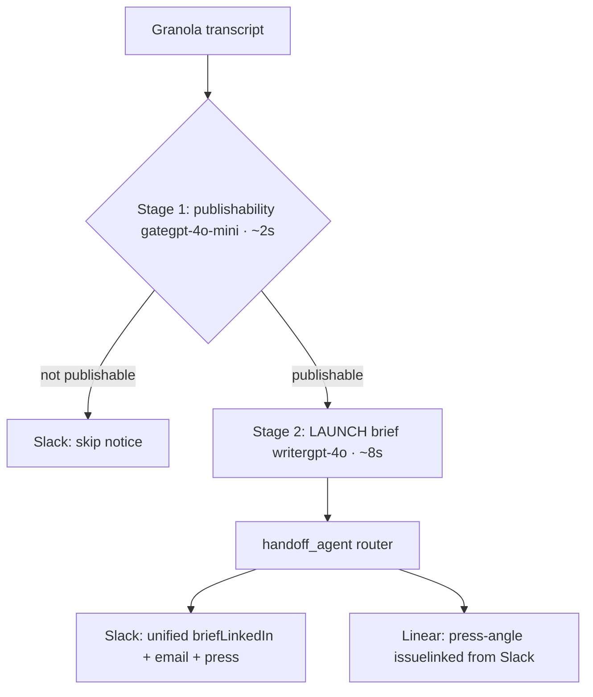

# Utopia Launch Brief

> An AI agent that turns a Granola meeting transcript into a publishable content brief — LinkedIn post, follow-up email, and press angle — delivered into the marketing team's existing tools in ~15 seconds.

Built for The Utopia Studio's Marketing & Events function (Co-Build M7 — Go-to-Market). One node in the Utopia OS agent network.

---

## What it does

Marketing operators at Utopia Studio currently read each Granola transcript by hand and draft three pieces of content from scratch — about 35–45 minutes per important meeting. This agent automates the draft step:

1. **Reads** a Granola meeting note (via Personal API) or a local transcript file
2. **Gates** publishability with a cheap classifier — skips logistics-only or confidential meetings
3. **Drafts** three outputs mapped to the LAUNCH framework:
   - LinkedIn post (Amplify) — broad amplification of a meeting moment
   - Personalised follow-up email (Nurture) — to one specific attendee
   - One-line press angle + supporting points (Convert) — for the PR pipeline
4. **Routes** all three drafts into one unified Slack message in `#marketing-drafts`, plus a Linear issue for press-angle tracking
5. **Filters** confidential content — compensation, HR, off-the-record material never surfaces in drafts

Marketing reviews drafts in Slack, copies, ships.

---

## Architecture



Two LLM stages, three Python modules, two external destinations. Each stage produces structured output that the next stage (or another agent) consumes — the JSON brief between stages is the inter-agent contract.

---

## Quick start

### Setup (~10 min)

```bash
git clone 
cd utopia-launch-brief
python -m venv venv

# macOS/Linux
source venv/bin/activate

# Windows PowerShell
venv\Scripts\activate

pip install -r requirements.txt
cp .env.example .env
# Edit .env and fill in your API keys (see Environment variables below)
```

### Run end-to-end

The single orchestrator command:

```bash
# Latest Granola meeting (one-keystroke workflow)
python launch_brief.py --latest

# Or: a specific Granola note ID
python launch_brief.py not_xxxxx

# Or: a local transcript file (no Granola key needed)
python launch_brief.py samples/input_transcript.txt
```

Within ~15 seconds you'll see:
- A unified brief landing in `#marketing-drafts` in your Slack
- A Linear issue created for the press angle, linked from the Slack message

For non-publishable meetings (pure logistics or confidential), the agent posts a "⊘ Meeting skipped" notice to Slack and stops — no drafts, no Linear issue.

---

## CLI reference

`launch_brief.py` is the main entry point.

| Command | What it does |
|---|---|
| `python launch_brief.py --latest` | Run on the most recent Granola meeting |
| `python launch_brief.py --pick` | Numbered list of recent meetings, pick interactively |
| `python launch_brief.py --list` | List recent Granola meetings (no agent run) |
| `python launch_brief.py --post-list` | Post the meeting list to Slack with copyable run commands |
| `python launch_brief.py not_xxxxx` | Run on a specific Granola note ID |
| `python launch_brief.py path/to/transcript.txt` | Run on a local transcript file |
| `python launch_brief.py --latest --no-route` | Generate brief only, skip routing |

You can also run the two underlying scripts separately for debugging:

```bash
python primary_agent.py         # transcript → JSON
python handoff_agent.py     # JSON → Slack + Linear
```

PowerShell users: the Unix pipe `|` syntax doesn't work; use command substitution instead:

```powershell
python handoff_agent.py (python primary_agent.py samples/input_transcript.txt)
```

---

## The Skill Pack

The prompts ship in **Utopia Studio's Skills marketplace format** under `utopia-skills/`. This pack drops directly into `The-Utopia-Studio/skills/` as `utopia-studio-cobuild-gtm-launch-brief/`:
utopia-skills/utopia-studio-cobuild-gtm-launch-brief/
├── README.md                            # pack description
├── meeting-publishability-gate/
│   └── SKILL.md                         # the gate skill
└── launch-brief-writer/
├── SKILL.md                         # the writer skill
├── studio-facts.md                  # injected alongside writer at runtime
└── examples/
├── publishable-input.txt
└── publishable-output.json

Two composable skills, both in the SKILL.md format used by Claude Code and Cursor:

- **`meeting-publishability-gate`** — small, fast classifier. Decides if a transcript contains content worth drafting. Runs on `gpt-4o-mini`.
- **`launch-brief-writer`** — main creative skill. Encodes the LAUNCH framework, studio voice rules, JSON schema, hard rules, and one worked example. Runs on `gpt-4o`.

`studio-facts.md` carries the studio's factual context (people, funds, partnerships, milestones) and is injected dynamically. Update it when studio facts evolve — no prompt edits needed.

---

## Repo structure
utopia-launch-brief/
├── primary_agent.py              # Stage 1+2: transcript → JSON brief
├── handoff_agent.py              # Router: JSON brief → Slack + Linear
├── launch_brief.py               # End-to-end orchestrator (recommended entry point)
├── granola_client.py             # Minimal Granola Personal API client
├── requirements.txt
├── .env.example                  # API key template
├── .gitignore
├── README.md                     # this file
├── samples/
│   ├── input_transcript.txt      # main demo input (publishable)
│   ├── output_brief.json         # demo output, matching above
│   ├── logistics_only.txt        # tests the skip path
│   └── confidential_mix.txt      # tests confidentiality filtering
├── outputs/                      # runtime briefs land here (gitignored)
└── utopia-skills/                # Utopia Studio Skills marketplace format
└── utopia-studio-cobuild-gtm-launch-brief/
├── README.md
├── meeting-publishability-gate/SKILL.md
└── launch-brief-writer/
├── SKILL.md
├── studio-facts.md
└── examples/

---

## APIs and integrations

| Service | Used for | Auth |
|---|---|---|
| **OpenAI** `gpt-4o-mini` | Stage 1 publishability gate | `OPENAI_API_KEY` |
| **OpenAI** `gpt-4o` | Stage 2 LAUNCH brief writer (JSON-mode) | `OPENAI_API_KEY` |
| **Granola Personal API** | Fetching meeting transcripts | `GRANOLA_API_KEY` (Business plan or 30-day trial) |
| **Slack Web API** | Posting unified briefs via Block Kit (`chat:write` scope) | `SLACK_BOT_TOKEN`, `SLACK_CHANNEL_ID` |
| **Linear GraphQL API** | Filing press angle as a trackable issue | `LINEAR_API_KEY`, `LINEAR_TEAM_ID` |

No vector DBs. No agent frameworks. Four Python dependencies, five API integrations, ~600 lines of code.

---

## Environment variables

See `.env.example`. Six values:
OPENAI_API_KEY      # OpenAI API key
GRANOLA_API_KEY     # Granola Personal API key (optional — local transcripts work without it)
SLACK_BOT_TOKEN     # xoxb-... from your Slack app
SLACK_CHANNEL_ID    # channel ID where briefs are posted (e.g., C0123456789)
LINEAR_API_KEY      # lin_api_... from Linear workspace settings
LINEAR_TEAM_ID      # UUID for the Linear team where press-angle issues land

**To find the Slack channel ID:** right-click the channel → *View channel details* → scroll to the bottom.

**To find the Linear team ID:**

```bash
curl -X POST https://api.linear.app/graphql \
  -H "Authorization: <your_linear_key>" \
  -H "Content-Type: application/json" \
  -d '{"query":"{ teams { nodes { id name } } }"}'
```

**To find a Granola note ID** (the web URL UUID is different from the API ID):

```bash
python -c "from granola_client import GranolaClient; import json; print(json.dumps(GranolaClient().list_notes(), indent=2))"
```

---

## Sample files

Three sample transcripts in `samples/` exercise the agent's behavior:

- **`input_transcript.txt`** — Radical Asia pipeline meeting. Publishable. The main demo input. Output saved in `samples/output_brief.json`.
- **`logistics_only.txt`** — 5-minute scheduling conversation. Gate correctly marks `is_publishable: false`. Verifies the skip path.
- **`confidential_mix.txt`** — 1:1 with both publishable content (47-day benchmark) and confidential material (compensation, personal info). Agent drafts from the safe content; sensitive material does not surface.

---

## Known limitations and next steps

Deliberately scoped for this submission. The following are upgrade paths, ranked by impact (and discussed in the writeup's *"If I had two more days"* section):

1. **Full Slack slash-command interface** (`/launch list`, `/launch run not_xxx`). Closes the workflow inside Slack but requires a public webhook server. The current `--post-list` is a 20-minute half-measure.
2. **Multi-prompt chain.** Splitting the writer into Extractor → LinkedIn/Email/Press specialists improves per-output accuracy at the cost of latency and complexity.
3. **Idempotency.** Running on the same meeting twice creates duplicates. A small JSON or SQLite dedup store fixes this.
4. **Critic/editor pass.** A second LLM call that verifies drafts against voice rules and confidentiality patterns before posting.
5. **Reaction-based approval in Slack.** Marketing reacts with ✓ to approve, ↻ to regenerate. Cleanest human-in-the-loop pattern.
6. **Feedback loop.** Capture which drafts marketing ships vs. rewrites, use diffs to refine the prompt over time.
7. **Variant generation.** 2–3 alternative drafts per output, operator picks.
8. **Multi-language support.** Studio voice rules assume English; Arabic and SE Asian variants would expand coverage.
9. **Retry logic** with `tenacity` for transient API failures.

The gate filtering, error handling, and skill packaging in the current submission were prioritised over the items above as the highest-leverage moves at this scope.

---

## License

MIT.